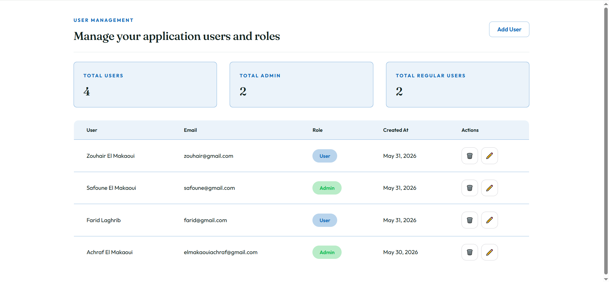
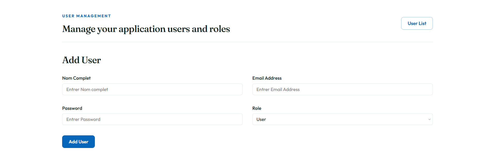
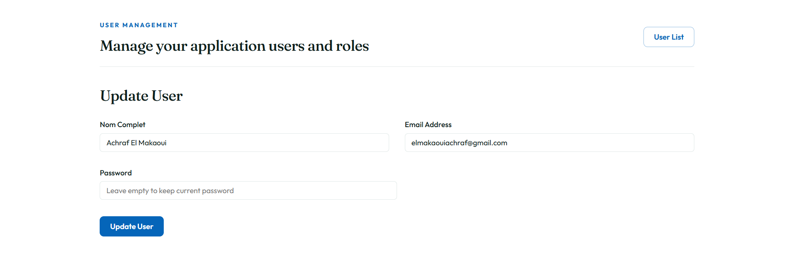

# User Management TP

A full-stack user management application built with **Express.js** and **React**. Supports full CRUD operations, create, read, update, and delete users with role-based access control via an `isAdmin` flag.

---

## Tech Stack

**Backend**
- Node.js + Express.js
- MongoDB + Mongoose
- bcrypt (password hashing)

**Frontend**
- React
- CSS (custom, no UI library)

---

## Project Structure

```
UserManagement_TP/
│
├── backend/
│   ├── models/
│   │   └── User.js
│   ├── routes/
│   │   ├── auth.js
│   │   └── user.js
│   └── postman_test/
│       ├── GET_USERS.png
│       ├── GET_USER_BY_ID.png
│       ├── POST_USER.png
│       ├── PUT_USER.png
│       ├── DELETE_USER.png
│       └── USER_LOGIN.png
│
└── frontend/
    ├── public/
    │   └──index.html
    │
    └── src/
        ├── App.js
        ├── index.js
        │
        ├── components/
        │   ├── newUser/
        │   │   ├── NewUser.jsx
        │   │   └── NewUser.css
        │   ├── updateUser/
        │   │   ├── UpdateUser.jsx
        │   │   └── UpdateUser.css
        │   ├── usersStats/
        │   │   ├── UsersStats.jsx
        │   │   └── UsersStats.css
        │   └── usersTable/
        │       ├── UsersTable.jsx
        │       └── UsersTable.css
        │
        └── pages/
            ├── NewUserPage/
            │   ├── NewUserPage.jsx
            │   └── NewUserPage.css
            ├── UpdateUserPage/
            │   ├── UpdateUserPage.jsx
            │   └── UpdateUserPage.css
            └── UsersPage/
                ├── UsersPage.jsx
                └── UsersPage.css
```

---

## API Endpoints

| Method | Endpoint | Description |
|--------|----------|-------------|
| `GET` | `/users` | Get all users |
| `GET` | `/users/:id` | Get a user by ID |
| `POST` | `/auth/register` | Create a new user |
| `POST` | `/auth/login` | User login |
| `PUT` | `/users/:id` | Update a user |
| `DELETE` | `/users/:id` | Delete a user |

---

## User Schema

```js
{
  nomComplet : String   // required
  email      : String   // required, unique, lowercase
  password   : String   // required, hashed with bcrypt
  isAdmin    : Boolean  // default: false
  createdAt  : Date     // auto-generated
  updatedAt  : Date     // auto-generated
}
```

Passwords are hashed with **bcrypt** before saving. The `password` field is never returned in API responses.

---

## Screenshots

### Users List
<!-- Add your screenshot path here, e.g. ./screenshots/users-list.png -->


### New User
<!-- Add your screenshot path here, e.g. ./screenshots/new-user.png -->


### Update User
<!-- Add your screenshot path here, e.g. ./screenshots/update-user.png -->


---

## Features

- **List users** — table view with avatar initials, name, email, role badge, and creation date
- **Create user** — dedicated page with full name, email, password, and admin toggle
- **Edit user** — pre-filled form on a dedicated page; leave password blank to keep the current one
- **Delete user** — confirmation before permanent removal
- **Stats panel** — live count of total users, admins, and regular users
- **Postman tests** — full API test collection screenshots included in `backend/postman_test/`
